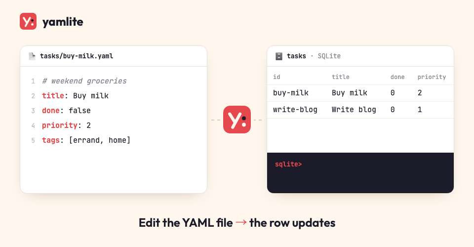
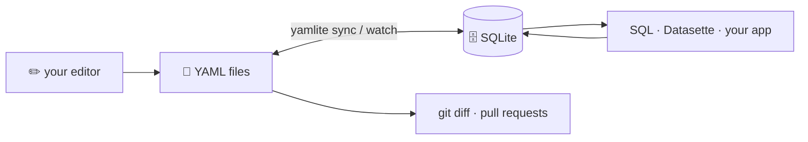
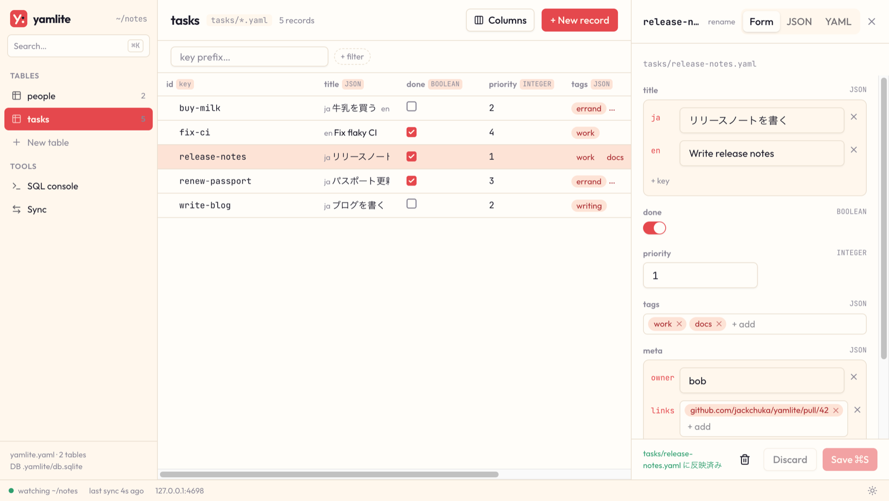
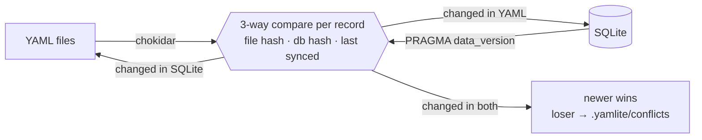

<p align="center">
  
</p>

<h1 align="center">yamlite</h1>

<p align="center">
  <strong>Your YAML files, queryable with SQL.<br>Your SQLite database, reviewable in git.</strong>
</p>

<p align="center">
  <a href="https://github.com/jackchuka/yamlite/actions/workflows/ci.yml"></a>
  <a href="https://www.npmjs.com/package/@jackchuka/yamlite"></a>
  
  <a href="LICENSE"></a>
</p>

---

yamlite keeps a folder of YAML files and a local SQLite database in sync, in both directions, continuously. Edit a file in your editor and the row changes. Run an `UPDATE` and the file changes — with your comments still in place.

<p align="center">
  
</p>

## Why

YAML is great for data humans write: readable, diffable, comment-friendly, git-native. It is terrible to query. SQLite is the opposite. yamlite lets you keep both without choosing:

- **Hand-written data, SQL queries** — tasks, notes, contacts, configs, fixtures. Keep editing YAML; ask questions with SQL, Datasette, or any SQLite tool.
- **App-written data, git history** — let a script or app write to SQLite and get every change as a reviewable YAML diff.



## Features

- **Two-way, continuous sync** — `yamlite watch` reacts to file saves and to commits from any process writing the database.
- **One schema file** — `yamlite init` writes `yamlite.yaml` from your data. Commit it next to your YAML: it pins every column's type, and yamlite keeps the database matching it.
- **Comment-preserving writes** — only changed fields are rewritten; comments, key order and flow style (`[a, b]`) survive.
- **Typed columns** — `true` → `BOOLEAN`, `1` → `INTEGER`, `1.5` → `REAL`, maps/lists → `JSON`, inferred from your data.
- **Safe by default** — broken YAML is never overwritten or treated as deleted, mass deletions are refused, and the losing side of a conflict is always backed up.
- **Rebuildable** — the database is a cache. Delete it, run `sync`, and it comes back from YAML.
- **CLI and library** — use the `yamlite` command or `import { open } from "@jackchuka/yamlite"`.
- **No native dependencies** — built on Node's built-in `node:sqlite`.

## Installation

Requires Node.js 24.16 or later.

```bash
npm install -g @jackchuka/yamlite
# or
pnpm add -g @jackchuka/yamlite
```

Or run it without installing:

```bash
npx @jackchuka/yamlite status ./notes
```

## Quick Start

1. **Lay out your data.** Each entry directly under the root becomes a table:

   ```
   notes/
   ├── tasks/              # directory → one record per file, key = path (subfolders too)
   │   ├── buy-milk.yaml
   │   └── write-blog.yaml
   └── people.yaml         # file → a list of records, key = `id`
   ```

   ```yaml
   # tasks/buy-milk.yaml
   title: 牛乳を買う
   done: false
   priority: 2
   tags: [errand, home]
   ```

   ```yaml
   # people.yaml
   - id: 1
     name: Alice
     team: platform # lead
   - id: 2
     name: Bob
     team: sales
   ```

2. **Create the schema.** `yamlite init` infers tables and column types from your files (or an existing database) and writes `notes/yamlite.yaml`. Review it and commit it with your data.

   ```bash
   yamlite init notes
   ```

3. **Preview, then sync.**

   ```bash
   yamlite status notes   # shows what would change, writes nothing
   yamlite sync notes
   ```

4. **Query and edit with SQL.** The database lives at `notes/.yamlite/db.sqlite`.

   ```bash
   sqlite3 notes/.yamlite/db.sqlite "select team, count(*) from people group by team"
   ```

   Writes go the other way too — only the changed field is rewritten, and comments stay:

   ```console
   $ sqlite3 notes/.yamlite/db.sqlite "update tasks set done = 1 where id = 'buy-milk'"
   $ yamlite sync notes > /dev/null && cat notes/tasks/buy-milk.yaml
   # tasks/buy-milk.yaml
   title: 牛乳を買う
   done: true
   priority: 2
   tags: [errand, home]
   ```

5. **Keep them in sync while you work.**

   ```console
   $ yamlite watch notes
   yamlite · watching people, tasks in ~/notes · Ctrl-C to stop

     12:03:41  tasks   → db        buy-milk
     12:03:55  people  → file      2
     12:04:02  tasks   − file      renew-passport
   ```

6. **Ignore the cache.** Add `.yamlite/` to your `.gitignore` — the YAML files and `yamlite.yaml` are what you commit.

## Commands

| Command                 | Options                                                          | Description                                               |
| ----------------------- | ---------------------------------------------------------------- | --------------------------------------------------------- |
| `yamlite init [root]`   | `--db`, `--force`, `--print`                                     | Create `yamlite.yaml` from your files and database        |
| `yamlite status [root]` | `--db`, `--table <name>`, `--json`                               | Show what `sync` would change, without writing            |
| `yamlite sync [root]`   | `--db`, `--table <name>`, `--force`, `--force-convert`, `--json` | Sync once; exits 1 if any table fails                     |
| `yamlite watch [root]`  | `--db`, `--quiet`                                                | Sync on every file save, database commit or config change |
| `yamlite serve [root]`  | `--db`, `--port` (4610), `--host` (127.0.0.1), `--open`          | Open the web UI and sync continuously                     |
| `yamlite export [root]` | `--out` (.yamlite-export), `--table`, `--force`                  | Write the web UI as a read-only static site               |

- `root` defaults to the current directory.
- `--db <path>` overrides the default `<root>/.yamlite/db.sqlite`.
- `--table <name>` can be repeated.
- `--force` allows mass deletions that the deletion guard would refuse.
- `--force-convert` clears values that cannot be converted when a column type changes (see [Column types](#column-types)).
- `--json` prints the raw results (per table: counts, `changes` per key, `conflicts`, `warnings`) for scripting.
- Output is colored on a terminal; set `NO_COLOR=1` to disable it.

## Web UI

```bash
yamlite serve notes --open
```

<p align="center">
  
</p>

`serve` runs `watch` and a local web UI in one process: browse and edit records with forms that fit each column type, check each table's columns, references and indexes, see every table, view and reference on one diagram (ERD), run SQL, and see sync activity, warnings and conflicts as they happen. Edits from the UI are written to the database and reach your YAML files through the same sync as any other app, so comments and the safety checks all apply. A conflict's losing side can be restored from the Sync page.

- It listens on `127.0.0.1:4610` and prints a URL with an access token (new for each run, reusable until the process stops); open that URL (or pass `--open`). Requests without the token, from other sites, or with an unexpected `Host` are refused.
- `serve` and `watch` cannot run on the same folder at the same time.
- `--host 0.0.0.0` exposes it to your network; anyone with the URL can then change your data.
- The ERD page marks references with problems. Click a table to highlight its neighbours, or double-click it to open the table. The layout is recomputed only when the tables, columns or references change, so nodes you drag stay where you put them.

## Pages

Add your own screens — a kanban board, a dashboard — to `serve`. A page is one HTML file that reads and writes your data through `window.yamlite`, limited to what `yamlite.yaml` allows it.

```yaml
pages:
  board:
    path: .pages/kanban.html # a dot-folder: a plain folder under the root would become a table
    title: Task board
    access: { tasks: write, people: read } # tables and views; nothing else is reachable
    sql: false # true allows SELECT over the names in access
    network: [] # origins the page may load scripts, styles, images and fonts from, and connect to
```

Start from [`examples/pages/kanban.html`](examples/pages/kanban.html): copy it into `.pages/`, set `TABLE`, `KEY`, `GROUP` and `TITLE` at the top, and declare it as above.

| Call                                                                                             | Does                                                                                                                                              |
| ------------------------------------------------------------------------------------------------ | ------------------------------------------------------------------------------------------------------------------------------------------------- |
| `await yamlite.ready`                                                                            | `{ page, title, access, sql, network, readOnly }`                                                                                                 |
| `yamlite.rows(table, { filter, sort, prefix, limit, offset })`                                   | `{ rows, total }`, reads tables and views, same filters as the table screen; `limit` ≤ 500                                                        |
| `yamlite.get(table, key)`                                                                        | `{ row, file }`; tables only, a view gives 400                                                                                                    |
| `yamlite.create(table, key, values)` / `update(table, key, values, base)` / `remove(table, key)` | needs `write`; `update` fails with status 409, `extra.stale` (the fields) and `extra.current` (their values now), if a field changed since `base` |
| `yamlite.sql(select)`                                                                            | needs `sql: true`; one SELECT over the names in `access`                                                                                          |
| `yamlite.on("change", ({ tables }) => …)`                                                        | called after a sync changes a table or view the page can read                                                                                     |
| `yamlite.open(table, key)`                                                                       | opens the record in yamlite's own form; tables only, a view gives 400                                                                             |

Errors reject with `yamlite.YamliteError` (`status`, `message`, `extra`).

- The page runs in a sandboxed frame with no access to yamlite's session; every call goes through yamlite, which checks it against `access`. SQL runs on a read-only connection where SQLite itself refuses tables outside `access`.
- `network` is enforced with a Content Security Policy. It limits what the page loads and where it connects. Declaring an origin lets the page send data, including anything it can read through `access`, off your machine to that origin.
- Every page, even with `network: []`, can leak data by navigating its own frame to another site with the data in the URL. yamlite then disconnects the page, but the data has already left. Only declare pages you trust, as you would any script you run.
- In an [export](#export) pages are read-only, and `access` does not hide data: the exported `db.sqlite` is downloadable, and `sql: true` reads every exported table. Pages whose `access` names a table left out of the export are skipped with a warning.

## Export

```bash
yamlite export notes --out ../notes-site
```

`export` writes the web UI as a static site you can put on any web server: browse tables and views, open records with their YAML, filter, sort, see the ERD, and run `SELECT` in the SQL console. Nothing can be written: there are no save, delete or new buttons, no Sync page, and the console refuses anything but `SELECT`, `EXPLAIN` and `VALUES`. The data runs in the browser with [sql.js](https://sql.js.org).

- It syncs your YAML into a temporary database, so it works in CI without `.yamlite/` and never touches the root: no `yamlite.yaml` changes, no `.yamlite/` folder, no lock.
- `--table` (repeatable) limits the export to those tables; the others are left out of the database too.
- Output: `index.html`, `assets/`, and `data/` (`snapshot.json`, `db.sqlite`, one `yaml/<table>.json` per table, holding each YAML file's text once). Every URL is relative, so it works under a subpath such as GitHub Pages' `/<repo>/`.
- Machine paths are hidden: the root is shown as its folder name, and paths outside the root as their base names.
- `--out` defaults to `.yamlite-export`. It cannot be the data root, an ancestor of it, or `.yamlite/` (also when reached through a symlink or a different letter case), and inside the root it must sit in a dot-folder (yamlite ignores those; a plain folder would become a table on the next sync).
- An existing `--out` folder is replaced only if it holds a previous export or is empty; `--force` replaces anything else, but never the root, its ancestors or `.yamlite/`.
- Open it over HTTP (`npx serve ../notes-site`); browsers do not load the app from `file://`, so the page opened that way only says to use a web server.
- Set `SOURCE_DATE_EPOCH` to make the output byte-for-byte reproducible.

Publishing to GitHub Pages:

```yaml
# .github/workflows/pages.yml
on: { push: { branches: [main] } }
permissions: { contents: read, pages: write, id-token: write }
jobs:
  deploy:
    runs-on: ubuntu-latest
    environment: github-pages
    steps:
      - uses: actions/checkout@v4
      - uses: actions/setup-node@v4
        with: { node-version: 24 }
      - run: npx @jackchuka/yamlite export .
      - uses: actions/upload-pages-artifact@v3
        with: { path: .yamlite-export }
      - uses: actions/deploy-pages@v4
```

## Working with your data

### Tables

| Under the root       | Table    | Records                                                          | Key                                                               |
| -------------------- | -------- | ---------------------------------------------------------------- | ----------------------------------------------------------------- |
| `tasks/` (directory) | `tasks`  | one per `*.yaml` / `*.yml` file in the folder and its subfolders | the path without extension (`id`): `buy-milk`, `archive/buy-milk` |
| `people.yaml` (file) | `people` | each item of the top-level list                                  | the `id` field                                                    |

Dotfiles, dot-folders and `node_modules` are ignored at every level, and `yamlite.yaml` at the root. Symlinked files and directories are followed.

In a directory table, a file's own `id` field may hold the full key (`archive/buy-milk`) or just the file name (`buy-milk`); anything else is a warning and the path wins. Inserting a row with a nested key creates its folders, and deleting the last record in a folder removes the emptied folder. A folder or file that another table is configured at (`archive: { path: tasks/archive }`) is left to that table. Renaming a folder deletes and re-adds its records, so renaming a large folder can trip the mass-deletion guard and need `--force` (see [Safety](#safety)).

### Types

| YAML value              | Column type | Stored as                          |
| ----------------------- | ----------- | ---------------------------------- |
| `true` / `false`        | `BOOLEAN`   | `1` / `0`                          |
| `42`                    | `INTEGER`   | integer (big values stay exact)    |
| `1.5`, or ints + floats | `REAL`      | real                               |
| `hello`, `2026-10-01`   | `TEXT`      | text (YAML 1.2: dates are strings) |
| maps and lists          | `JSON`      | JSON text                          |

New YAML keys become new columns automatically. Inference never changes an existing column's type (scalar values that don't fit are stored as-is with a warning); to change it, declare the type in `yamlite.yaml` — see [Column types](#column-types).

### Nested values

Nested data stays in one `JSON` column per top-level key. Use SQLite's JSON functions:

```yaml
# tasks/release.yaml
title:
  en: Write release notes
  ja: リリースノートを書く
```

```sql
select json_extract(title, '$.ja') from tasks;                    -- read a nested value
update tasks set title = json_set(title, '$.ja', '書き直す');      -- written back as a map
select * from tasks, json_each(tags) where json_each.value = 'a'; -- filter on list items
```

A field must be **always a scalar or always a map/list** across records. Mixing them in a new field stops the table with an error listing which records are which; a record that doesn't fit an existing column is skipped with a warning. If a JSON column in the database holds something that isn't a map or list (for example after a manual `UPDATE`), that row is not written back to YAML until you fix it in SQL or edit the file. To migrate a field (say, `title` → `{en, ja}`), declare it in `yamlite.yaml` (`columns: { title: JSON }`) and sync: the column is converted, and every record not yet converted shows up as a warning until you change its file.

### Expanded views

Lists inside records — milestones of a project, tasks of a milestone — can be queried as rows. Declare them under `expand`, and every sync keeps a read-only SQLite view per list:

```yaml
tables:
  projects:
    expand:
      milestones: # the JSON column → view projects__milestones
        columns: { points: INTEGER } # optional: pin a type
        expand:
          tasks: # a field of each milestone → view projects__milestones__tasks
            references: { owner: people }
```

```sql
select p.title, m.title, t.owner
from projects p
join projects__milestones m on m.projects_id = p.id
join projects__milestones__tasks t on t.projects_id = m.projects_id and t.milestones_idx = m.idx;
```

- A view's first columns name the row: the table's key (`projects_id`), the positions of the lists above it (`milestones_idx`; a repeated name gets `_2`, `_3`, … as in `children_idx_2`), and its own position — `idx` for a list, `key` for a map. Then one column per field of the items; items that aren't maps (`tags: [a, b]`) go to a `value` column.
- Columns and types are inferred from the data on every sync; `columns` pins a type. Nothing is written back to `yamlite.yaml`.
- Views are read-only: edit the YAML, or update the JSON column of the table. `serve` lists them under their table and opens the record a row comes from.
- `references` on a view are checked like a table's, and `status` shows planned `+ view` / `− view` changes. A list that can't become a view (the field isn't a JSON column, or a view of that name was made by hand) is a warning.

## Configuration

`<root>/yamlite.yaml` (or `yamlite.yml`) is required — it is the schema of record. Create it with `yamlite init`, commit it with your data, and edit it to change keys, types, indexes or to add tables that live elsewhere. yamlite keeps it current for you: when `sync` or `watch` meets a new table under the root, a new YAML key, or a column an app added to the database, it appends it to `yamlite.yaml` (existing lines, comments and order are left untouched) — so new schema shows up as a reviewable diff. `yamlite status` lists these as `+ column … (will be added to yamlite.yaml)` first. `yamlite watch` reloads it on save — and picks up tables added under the root — without a restart; a broken file is reported and the previous configuration stays in effect.

```yaml
tables:
  people:
    key: slug # default: id
    columns: { age: INTEGER, tags: JSON } # INTEGER | REAL | TEXT | BOOLEAN | JSON
    formats: { bio: markdown } # how the web UI edits a TEXT column
    expand: { tags: {} } # lists as views — see Expanded views
    indexes:
      - [team, age] # composite index
      - { columns: slug, unique: true }
      - { expr: "json_extract(meta, '$.ja')" } # index a nested value
  inbox:
    path: ~/Dropbox/inbox # relative paths resolve from the root
```

### Removing columns

Delete a column's line from `yamlite.yaml` and the next sync drops it from the database (with any yamlite-managed index on it). If YAML files still have that key, a file can't be read, or a row in the database still holds a value in that column (an unsynced or app-written value), the column is kept and listed in a warning until you resolve it or add the line back. Columns that were never declared — say, one an app added — are registered instead, never dropped.

### Column types

`columns` is declarative too. When a declared type differs from the column in the database, the next sync rebuilds the table with the new type (in one transaction, following SQLite's recommended procedure) and shows `↻ column title TEXT → JSON` beforehand in `yamlite status`.

- Values are converted where possible (`1` ↔ `"1"`, `"true"` → `BOOLEAN`, JSON text → `JSON`).
- A value that can't be converted is cleared and refilled from YAML, which stays the source of truth. If that value was changed in SQL and never synced, the rebuild stops instead; fix the row or pass `--force-convert` to clear it.
- Tables with triggers, CHECK, UNIQUE or foreign-key constraints, COLLATE, AUTOINCREMENT, generated columns, `STRICT` or `WITHOUT ROWID`, indexes yamlite doesn't manage, or other tables referencing them are never rebuilt; yamlite reports an error and leaves the migration to you.
- The key column's type is never changed; to change it, recreate the database (delete `.yamlite/`).

### Formats

`formats` tells the web UI how to edit a `TEXT` column; it never changes the database. `markdown` shows the field as rendered Markdown, with an Edit tab for the source. The editor keeps the text exactly as you type it, so saving doesn't reformat the Markdown in your YAML. A format on a column declared with another type is an error. `expand` entries take `formats` too.

### References

Declare which fields point at other tables, and yamlite checks them on every sync — it never enforces them, so a typo or a record you haven't added yet is a warning, not a failed sync:

```yaml
tables:
  tasks:
    references:
      assignee: people # matches people's key column
      project: projects.slug # matches a specific column
      tags: labels # each item of a list is checked
```

```
! assignee "9" not found in people.id (buy-milk, call-mom)
```

Values are compared as text (`"1"` matches `1`). While watching, a change to `people` re-checks the tables that reference it. These are not SQLite foreign keys: nothing is rejected or cascaded, and you fix the YAML.

### Indexes

`indexes` is declarative: every sync makes the database match it. yamlite creates missing indexes and drops the ones you removed from the list, and leaves indexes you created yourself in SQL alone (its own are named `yamlite_<table>_<hash>`). An index that can't be created — a duplicate value for a `unique` index, or a column that doesn't exist yet — is reported as a warning and data keeps syncing. `yamlite status` shows planned index changes as `+ index` / `− index`.

## Safety

yamlite is built so that a sync never silently loses data:

- **Unreadable files are untouchable.** A YAML file with a syntax error, several documents, or the wrong top-level shape is never overwritten and never treated as a deletion: a record file is skipped, and a broken list file stops its table with an error. A subfolder that can't be read and a symlink whose target is gone also stop their table, since they may hold records. Fix it and the next sync picks it up.
- **Mass deletions are refused.** A sync that would delete more than `max(10, 50%)` of a table, or empty a table that had several records, stops unless you pass `--force`. A missing folder or a dropped table with previously synced records is an error, not a wipe.
- **Conflicts keep both sides.** If a record changed in YAML and in the database, the newer change wins and the other version is saved to `.yamlite/conflicts/<table>/`. The file's modification time is compared with the database's last write (any row, in any table), so the database wins whenever it was written after the file was saved. Each backup starts with a `# yamlite: {...}` comment line that records the table, the key, which side won and when.
- **Concurrent edits are detected.** Files are rewritten atomically and only if they are unchanged since they were read; database writes run in a transaction.
- **One writer at a time.** A lock in `.yamlite/` keeps two `sync`/`watch` processes from running together (`status` is always allowed).

## How it works



For every record, yamlite compares the current file hash and row hash with the hashes recorded at the last sync (stored in the `_yamlite_state` table). Only the side that changed is propagated, and each side is re-read after writing, so yamlite never echoes its own writes back or loops. Apart from three bookkeeping tables (`_yamlite_state`, `_yamlite_columns` and `_yamlite_views`) and the views you declare under `expand`, nothing is added to your database — no triggers, no change log.

## Library

```ts
import { open } from "@jackchuka/yamlite";

const y = await open({ root: "./notes" }); // or { db: "./app.db", tables: [{ name: "tasks", path: "./tasks" }] }

const plan = await y.status(); // what would change
const results = await y.sync(); // [{ table, ok, toDb, toFile, conflicts, warnings, ... }]

const watcher = y.watch({
  onSync: (r) => console.log(r.table, r.toDb, r.toFile),
  onConflict: (c) => console.warn(`conflict in ${c.table}/${c.key}, saved ${c.savedTo}`),
  onError: (e) => console.error(e),
});
await watcher.ready;

await y.close();
```

Open your own `node:sqlite` (or any SQLite) connection to write to the database — `watch` picks up commits from other connections automatically.

## Limitations

- Local, single-machine use. One yamlite process per data folder.
- Sized for hundreds to thousands of records per table; every sync scans the whole table.
- No SQLite foreign-key constraints ([references](#references) are checked, not enforced), Markdown front matter, or non-YAML formats yet.
- When a file is rewritten, the space before an inline comment is normalized to one (`a: 1  # note` → `a: 1 # note`).

## License

[MIT](LICENSE)
